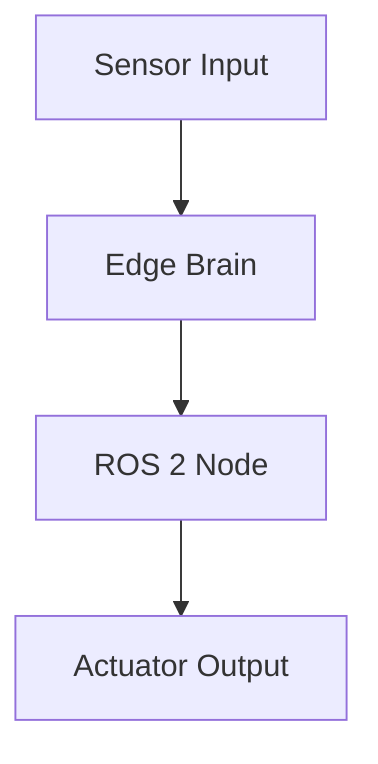

<!--
Sync Impact Report:
- Version Change: 0.0.0 -> 1.0.0 (Initial Adoption of Physical AI & Humanoid Robotics Constitution)
- Modified Principles: Replaced all generic software principles with book-specific principles (Identity, Style, Structure, Technical Consistency, Pedagogy, Ethics, QA, AI Protocol, Canon, Specs).
- Added Sections: 1-16 covering all aspects of book creation and Docusaurus integration.
- Templates Status: 
  - plan-template.md: ✅ Compatible (References constitution dynamically)
  - spec-template.md: ✅ Compatible
  - tasks-template.md: ✅ Compatible
-->

# Constitution: Physical AI & Humanoid Robotics

## 1. Book Identity & Purpose
**Title:** *Physical AI & Humanoid Robotics*  
**Theme:** AI systems that operate in the physical world; embodied intelligence.  
**Purpose:** To teach students how to design, simulate, and control humanoid robots using modern AI frameworks including ROS 2, Gazebo, Unity, NVIDIA Isaac, and Vision-Language-Action models.  
**Primary Audience:**  
- Undergraduate and graduate robotics/AI students  
- Robotics engineers  
- AI practitioners transitioning to embodied systems  
- Makers/hobbyists exploring humanoid robotics  

**Scope Includes:**  
- ROS 2 fundamentals  
- Physics simulation (Gazebo, Unity)  
- Digital twins  
- NVIDIA Isaac AI robotics ecosystem  
- Humanoid kinematics and control  
- VLA (Vision-Language-Action systems)  
- Conversational robotics  

**Scope Excludes:**  
- Low-level hardware PCB design  
- Advanced humanoid biomechanics  
- Reinforcement learning theory proofs  
- Purely digital AI (unless used for robotics control)  

## 2. Writing Style & Tone
### Narrative Voice
- Second person (“you will…”) for instructions  
- Third person (“the robot…”) for explanations  

### Language Level
- Professional but accessible  
- Avoid unnecessary jargon  
- Clearly define all technical terms  

### Tone
- Instructional  
- Engineering-focused  
- Realistic and grounded  

### Formatting Rules
- All code in Python ROS 2 format  
- Hardware lists in tables  
- Diagrams for architecture/system flows  
- No fictional storytelling unless illustrating engineering concepts  

## 3. Book Structure Standard
All chapters must follow this structure:

1. **Overview**  
2. **Why This Matters**  
3. **Key Concepts**  
4. **Detailed Explanations**  
5. **Hands-On Activity**  
6. **Example or Case Study**  
7. **Troubleshooting Tips**  
8. **Summary**  
9. **Assessment/Exercises**  

This applies to all modules: ROS 2, Gazebo, Isaac, humanoids, VLA, conversational robotics, etc.

## 4. Technical Consistency Rules

### Software Versions
- **ROS 2:** Humble or Iron  
- **OS:** Ubuntu 22.04 LTS  
- **Isaac Sim:** Latest 2024 release  
- **Gazebo:** Fortress/Garden  
- **Unity:** Current LTS  
- **OpenAI tools:** Whisper for voice → action  
- **LLMs:** GPT models with VLA integrations  

### Robotics Terminology
Use consistent terms for:  
- Robot body parts  
- Sensors (LiDAR, depth camera, IMU)  
- Jetson edge devices  
- ROS 2 components (nodes, topics, services, actions)  

### Hardware Name Consistency
Robots and devices must be consistently referred to as:  
- Unitree Go2  
- Unitree G1  
- Intel RealSense D435i  
- Jetson Orin Nano / Orin NX  
- “Digital Twin Workstation”  

## 5. Pedagogical Standards
Each chapter must include:  
- Clear learning outcomes  
- Conceptual explanations  
- Hands-on exercises (simulation or real hardware)  
- Real-world robotics examples  

### Learning Progression
1. Foundations  
2. ROS 2  
3. Simulation  
4. Isaac  
5. Humanoid robotics  
6. VLA  
7. Conversational robotics  
8. Capstone humanoid robot  

## 6. Ethical & Safety Guidelines
The book must include:  
- Safety warnings for robot operation  
- Hardware handling guidelines  
- Accurate descriptions of hardware limitations  
- Clear warnings about cloud latency and physical hazards  
- Emphasis on responsible AI and safe autonomy  

No exaggerated claims about robot capabilities.

## 7. Quality Assurance Rules
- Technical claims must be correct  
- Specs must match manufacturer documentation  
- No hallucinated tools or features  
- Diagrams must align with real architectures  
- Hands-on activities must be reproducible  
- Each chapter spec must include a **verification checklist**  

## 8. AI Writing Protocol
### Content Generation Rules
- AI must follow this constitution  
- Chapters only written after a specification  
- Maintain context across chapters  
- Prefer clarity over verbosity  

### Validation Rules
- Do not oversimplify robotics physics  
- Code must run on Ubuntu 22.04 with ROS 2  
- CLI commands must include prerequisites  

## 9. Canon of the Book (Shared Definitions)
The following terms must stay consistent:

- **Physical AI:** AI embodied in the physical world using sensors & actuators  
- **Digital Twin:** High-fidelity simulation of the robot  
- **VLA:** Vision-Language-Action robotics systems  
- **Edge Brain:** Jetson device running perception + control  
- **Sim Rig:** High-performance workstation for Isaac/Gazebo/Unity  

All examples must be built on this canonical set.

## 10. Chapter Specification Requirements
Each chapter spec must include:

- Chapter title  
- Learning outcomes  
- Required hardware/software  
- Core concepts  
- Hands-on activities  
- Example or case study  
- Required diagrams  
- Assessments/exercises  
- Cross-linking to other chapters  

No chapter may be produced without its specification.

## 11. Frontmatter / Metadata Rules (for Docusaurus)
Each generated chapter must include YAML frontmatter:

```yaml
---
id: <kebab-case-id>
title: "<Chapter Title>"
sidebar_label: "<Sidebar Label>"
description: "<Short description>"
slug: /<optional-custom-url>
keywords:
  - robotics
  - humanoids
  - ros2
  - ai
---
```

Rules:
- `title` must match the chapter spec
- `id` must be unique and in kebab-case
- `description` must be 1–2 sentences
- The frontmatter must appear at the top of each .md or .mdx file

## 12. File & Folder Structure Rules (for GitHub Pages + Docusaurus)
All generated content must follow:

```text
/docs/
  introduction/       (Weeks 1-2)
  ros2/              (Weeks 3-5)
  simulation/        (Weeks 6-7)
  isaac/             (Weeks 8-10)
  humanoids/         (Weeks 11-12)
  vla/               (Module 4)
  conversational/    (Week 13)
  capstone/          (Final Project)
  hardware/          (Hardware Requirements)
```

Rules:
- All diagrams saved as .png or .svg inside `/static/img/diagrams/`
- All code examples go under `/examples/`
- Chapter files use `.mdx` when containing React components

## 13. Diagram Format Requirements
Diagrams must follow one of these formats:

**MermaidJS (preferred for Docusaurus)**

OR external images placed in `/static/img/diagrams/<name>.png`.

## 14. Spec-Kit Plus Interoperability Rules
Spec-Kit Plus must:
- Use this constitution as the primary governing document
- Generate chapter specifications first, then content
- Validate chapters using Section 7: QA Rules
- Maintain context across chapters (persistent canonical terms)
- Enforce consistent terminology and code formatting

## 15. Versioning Rules (for Docusaurus versioned docs)
- All book content defaults to `/current`
- Major software updates (e.g., ROS 2 Iron → Jazzy) create a new version folder
- The canon (Section 9) stays unchanged unless explicitly revised
- Previous versions remain accessible in the Docusaurus version dropdown

## 16. Code Block Rules
To ensure proper syntax highlighting:
- Use fenced code blocks
- ROS 2 Python nodes → `python`
- ROS 2 launch XML → `xml`
- Terminal commands → `bash`
- C++ snippets (if any) → `cpp`

Example:
```bash
ros2 run demo_nodes_cpp talker
```

## Governance

**Amendments:**
Changes to this Constitution require a Pull Request with explicit approval from the project maintainers.
- **Major Revisions**: Changes to Core Principles (1-10) or Canon (9) require a MAJOR version bump.
- **Minor Revisions**: Additions to Technical Rules (4) or Structure (11-16) require a MINOR version bump.
- **Patch Revisions**: Typos, clarifications, or non-semantic updates require a PATCH version bump.

**Compliance:**
All contributions, chapters, and code examples must comply with this Constitution. Automated checks (where possible) and manual reviews must enforce these rules.

**Version**: 1.0.0 | **Ratified**: 2025-12-06 | **Last Amended**: 2025-12-06