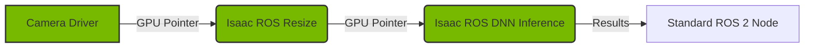

# AI Robot Brain (NVIDIA Isaac)

## 1. Overview

Traditional robotics ran on CPUs. Physical AI runs on GPUs. **NVIDIA Isaac** is a collection of accelerated libraries and tools specifically designed to bring the power of AI to robotics. It is not just one tool, but a platform:
- **Isaac Sim**: A photorealistic simulator built on Omniverse.
- **Isaac ROS**: A set of ROS 2 packages optimized for NVIDIA GPUs.
- **Isaac Lab**: A framework for robot learning (RL).

## 2. Why This Matters

Processing high-resolution camera feeds, running 3D SLAM, and executing large Transformer models (VLAs) is impossible on a standard CPU. Isaac allows you to offload these heavy tasks to the GPU, enabling real-time performance that was previously unattainable.

## 3. Key Concepts

### Hardware Acceleration (NITROS)
In standard ROS 2, passing an image between nodes involves copying it to the CPU memory, which is slow. Isaac ROS uses **NITROS (NVIDIA Isaac Transport for ROS)**, which allows zero-copy data transfer directly in GPU memory.

### Universal Scene Description (USD)
Isaac Sim uses Pixar's **USD** format to describe 3D worlds. Unlike URDF, USD supports complex layering, non-destructive editing, and physically based rendering (PBR) materials.

## 4. Hands-On Activity: Setting up the AI Brain

We will set up the environment required to run Isaac ROS. This requires a PC with an NVIDIA GPU (RTX 30 series or newer recommended).

### Step 1: Install NVIDIA Drivers
Ensure you have the proprietary drivers installed:
```bash
nvidia-smi
```
You should see your GPU details and CUDA version.

### Step 2: Install NVIDIA Container Toolkit
We run Isaac software in Docker containers to manage complex dependencies.
```bash
sudo apt-get install -y nvidia-container-toolkit
sudo nvidia-ctk runtime configure --runtime=docker
sudo systemctl restart docker
```

### Step 3: Run the Isaac ROS Common Container
NVIDIA provides a pre-configured Docker image.
```bash
cd ${ISAAC_ROS_WS}/src/isaac_ros_common
./scripts/run_dev.sh
```

### Step 4: Run AprilTag Detection
Inside the container, we can launch a hardware-accelerated AprilTag detector:

```bash
ros2 launch isaac_ros_apriltag isaac_ros_apriltag_usb_cam.launch.py
```
If you hold an AprilTag in front of your webcam, the node will output the detection pose at lightning speed, using the GPU for image processing.

## 5. Architecture Diagram

The Zero-Copy Pipeline:



## 6. Troubleshooting Tips

-   **"No CUDA-capable device is detected"**: Your container runtime is not configured correctly. Re-run `nvidia-ctk runtime configure`.
-   **Docker permission denied**: Add your user to the docker group: `sudo usermod -aG docker $USER`.

## 7. Summary

You have upgraded your robot's brain from a standard CPU to a GPU-accelerated supercomputer. With Isaac ROS, you can now run advanced perception algorithms that are essential for the next topic: Humanoid Robot Development.

## 8. Assessment

**Exercise**: Research the difference between "Isaac Gym" (legacy) and "Isaac Lab". Why did NVIDIA switch to Isaac Lab?
