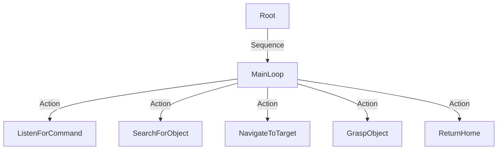

# Capstone: Autonomous Humanoid

## 1. Overview

Congratulations. You have mastered the nervous system (ROS 2), the digital twin (Gazebo), the brain (Isaac), the body (Humanoid Control), and the voice (Conversational AI). Now, you must combine them into a single, cohesive entity.

## 2. The Challenge: "The Tidy-Up Task"

Your robot is placed in a messy room. The user will issue a command like: *"Clean up the red soda can."*

**The robot must:**
1.  **Hear** and understand the command.
2.  **Explore** the room to find the object.
3.  **Navigate** to the object while avoiding obstacles.
4.  **Pick** up the object safely.
5.  **Place** it in the designated trash bin.
6.  **Report** completion verbally.

## 3. Architecture Reference

To manage this complexity, we recommend using a **Behavior Tree** (using `BehaviorTree.CPP` or `py_trees`).

## 4. Execution Plan

### Week 1: Integration
Set up the `ros_gz_bridge` and ensure Nav2 (Navigation Stack) works with your humanoid base. Create a map of the environment.

### Week 2: Perception
Integrate `isaac_ros_apriltag` or a YOLO model to detect the "soda can" and "trash bin". Calibrate the transforms between the camera and the gripper.

### Week 3: Manipulation & Logic
Use MoveIt 2 to plan the arm trajectory. Connect the VLA model to decide *how* to grasp the object (top-down vs side grasp).

### Week 4: Polish & Demo
Run full-system tests. Optimize for speed and reliability. Record your final demo video.

## 5. Summary

This book has taken you from a blank terminal to a fully autonomous humanoid. The field of Physical AI is just beginning. Go forth and build the future.

## 6. Assessment

**Final Deliverable**: A GitHub repository containing your full stack and a 5-minute video demonstrating the "Tidy-Up Task" in simulation (or real hardware).
