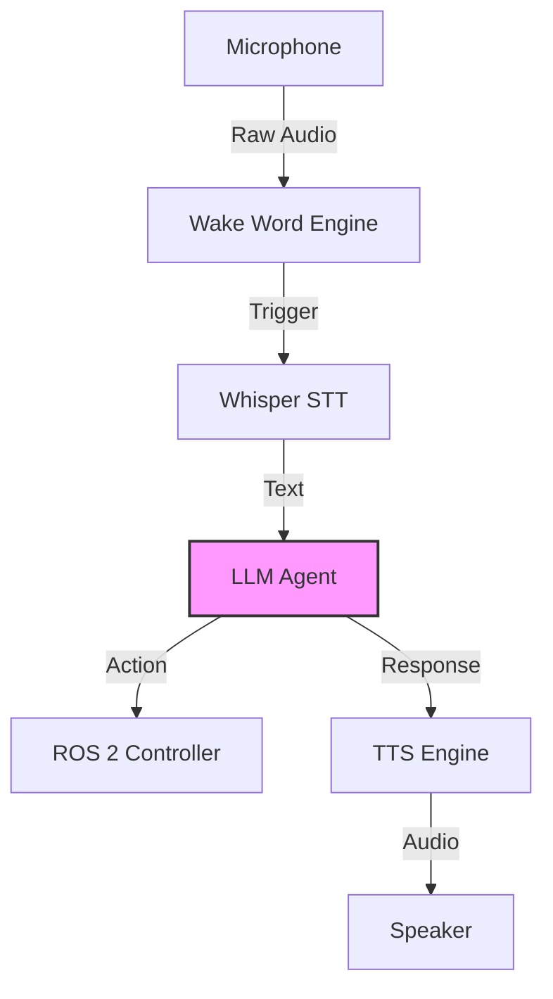

# Conversational Robotics

## 1. Overview

A truly helpful robot doesn't just act; it communicates. **Conversational Robotics** combines Physical AI with Natural Language Processing (NLP) and Audio Engineering. It enables the robot to hear commands, understand intent, and reply with a synthesized voice.

## 2. Why This Matters

Keyboards and screens are not always accessible. In an elder-care scenario, a user might call out "Help, I fell!" The robot must recognize this audio event immediately and respond.

## 3. Key Concepts

### The Audio Pipeline
1.  **Wake Word**: A tiny, low-power model runs locally, listening for a keyword (e.g., "Hey Gemini").
2.  **Speech-to-Text (STT)**: Once triggered, audio is recorded and transcribed (e.g., via OpenAI Whisper).
3.  **Brain (LLM)**: The text is processed to determine intent ("The user wants help").
4.  **Text-to-Speech (TTS)**: The robot generates a verbal response.

### Latency
In conversation, delays > 500ms feel awkward. Optimizing this pipeline is critical for natural interaction.

## 4. Hands-On Activity: Voice Control Node

We will create a simple ROS 2 node that listens for commands.

### Prerequisites
```bash
pip install openai-whisper sounddevice numpy
```

### The Listener Node
```python
import rclpy
from rclpy.node import Node
from std_msgs.msg import String
import whisper
import sounddevice as sd

class VoiceControl(Node):
    def __init__(self):
        super().__init__('voice_control')
        self.pub = self.create_publisher(String, '/voice_command', 10)
        self.model = whisper.load_model("base")
        self.get_logger().info("Listening...")

    def listen_and_transcribe(self):
        # Record 5 seconds of audio (Simplified)
        audio = sd.rec(int(5 * 16000), samplerate=16000, channels=1)
        sd.wait()
        
        # Transcribe
        result = self.model.transcribe(audio)
        text = result['text']
        self.get_logger().info(f"Heard: {text}")
        
        msg = String()
        msg.data = text
        self.pub.publish(msg)

# Main loop code omitted for brevity
```

## 5. Architecture Diagram

The Conversational Loop:



## 6. Troubleshooting Tips

-   **Robot Self-Noise**: Motors are loud. Use a directional microphone or placing the mic away from the actuators.
-   **Hallucinations**: Whisper might transcribe silence as "Thank you." Implement a Voice Activity Detector (VAD) filter.

## 7. Summary

We have given the robot a voice. It can now act as a social companion. This completes our component training. The final chapter brings it all together.

## 8. Assessment

**Exercise**: Why is it bad practice to run the heavy STT model continuously? Why do we need a wake word?
