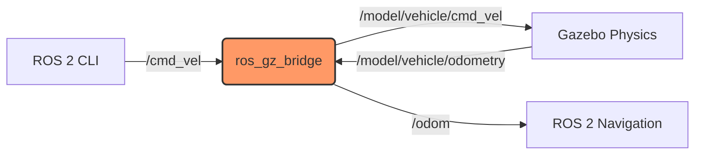

# Digital Twins (Gazebo & Unity)

## 1. Overview

A **Digital Twin** is a high-fidelity virtual replica of a physical system. In Physical AI, it serves as a training ground where robots can learn to walk, grasp, and navigate without the risk of damaging expensive hardware or harming humans.

While there are many simulators, we focus on **Gazebo** for its deep integration with ROS 2 and accurate physics, and **Unity** for its photorealistic rendering and VR capabilities.

## 2. Why This Matters

Physical AI models, especially those based on Reinforcement Learning (RL), require millions of trial-and-error attempts to converge. Running these on a physical robot would take years and destroy the mechanics. A simulation can run 1000x faster than real-time.

## 3. Key Concepts

### Robot Description Formats
- **URDF (Unified Robot Description Format)**: An XML format used by ROS 2 to describe the robot's kinematics (links and joints).
- **SDF (Simulation Description Format)**: An XML format preferred by Gazebo that includes environment details (lighting, physics properties).

### The Bridge (`ros_gz_bridge`)
Gazebo and ROS 2 are separate software stacks. They talk to each other via a "bridge" node that translates ROS 2 messages (like `/cmd_vel`) into Gazebo messages (like `/model/cmd_vel`) and vice versa.

## 4. Detailed Explanations

### Gazebo Architecture
Gazebo is split into:
- **gz-sim-server**: Runs the physics loop (headless).
- **gz-sim-gui**: Renders the 3D scene.

This separation allows you to run the heavy physics calculations on a cloud server while viewing the result on your laptop.

## 5. Hands-On Activity: Simulating a Diff-Drive Robot

We will launch a simple differential drive robot in Gazebo and control it from ROS 2.

### Step 1: Install Dependencies
```bash
sudo apt-get install ros-humble-ros-gz
```

### Step 2: Launch Gazebo
```bash
ros2 launch ros_gz_sim gz_sim.launch.py gz_args:="empty.sdf"
```

### Step 3: Spawn a Robot
In the Gazebo GUI, use the "Resource" tab to drag and drop a `Vehicle Blue` into the world.

### Step 4: Bridge the Topic
We need to bridge the velocity command topic. Create a bridge config or run it manually:

```bash
ros2 run ros_gz_bridge parameter_bridge /cmd_vel@geometry_msgs/msg/Twist@gz.msgs.Twist
```
*Note: This maps ROS 2 `Twist` to Gazebo `Twist`.*

### Step 5: Drive It
In a new terminal:
```bash
ros2 topic pub /cmd_vel geometry_msgs/msg/Twist "{linear: {x: 0.5, y: 0.0, z: 0.0}, angular: {x: 0.0, y: 0.0, z: 0.0}}"
```
You should see the blue vehicle move in the simulation window.

## 6. Architecture Diagram

The flow of data from your terminal to the physics engine:



## 7. Troubleshooting Tips

-   **Real-Time Factor (RTF) is low**: If RTF < 0.5, your computer is struggling to keep up. Try closing the GUI (`gz-sim-gui`) and running headless if you are just training.
-   **Bridge errors**: Ensure the message types match exactly. A ROS `Twist` must bridge to a Gazebo `Twist`.

## 8. Summary

You have crossed the bridge between the nervous system (ROS 2) and the virtual body (Gazebo). This setup is the foundation for all future chapters. Next, we will add a smarter brain to this body using NVIDIA Isaac.

## 9. Assessment

**Question**: Why do we need a bridge node? Why can't ROS 2 talk directly to Gazebo?
*Hint: Think about the different transport protocols (DDS vs. Gazebo Transport).*
