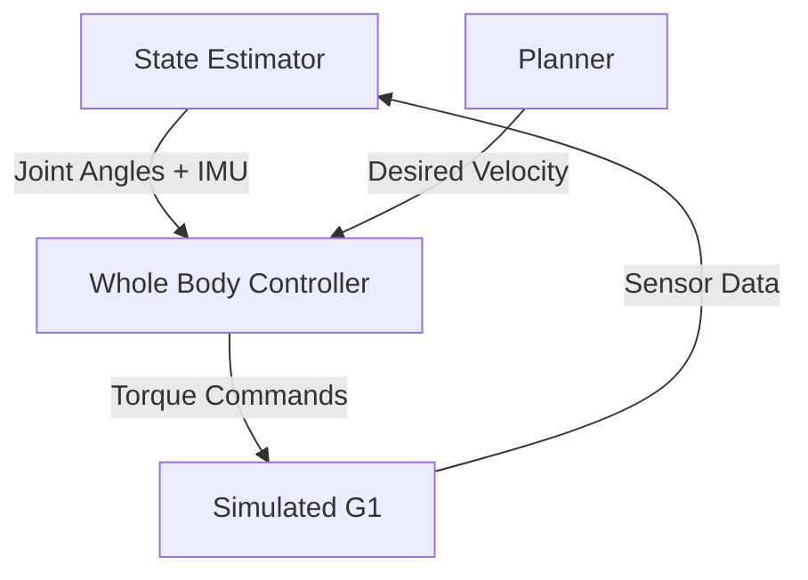

# Humanoid Robot Development

## 1. Overview

Humanoid robots represent the pinnacle of robotic complexity. Unlike a wheeled robot that is statically stable (it doesn't fall over when turned off), a humanoid is dynamically stable. It must constantly adjust its motors to fight gravity. In this chapter, we focus on the **Unitree G1**, a capable and accessible platform for humanoid research.

## 2. Why This Matters

Our world is designed for bipedal locomotion. We have stairs, narrow corridors, and door handles at specific heights. To be truly general-purpose, a robot must navigate this human-centric infrastructure.

## 3. Key Concepts

### Floating Base Dynamics
A robotic arm is fixed to a table. A humanoid's base (the pelvis/torso) is floating in space. Its position is determined by the interaction of its feet with the ground. This makes control significantly harder.

### Zero Moment Point (ZMP)
To stay upright while walking, the robot must keep its **Zero Moment Point**—the point where the reaction forces effectively act—within the support polygon of its feet. If the ZMP leaves this area, the robot falls.

## 4. Detailed Explanations

### The Unitree G1
The G1 is a reinforcement-learning native robot. It features:
-   High-torque joint motors.
-   3D LiDAR and Depth Cameras.
-   ~23 Degrees of Freedom (DoF).

## 5. Hands-On Activity: The "Hello World" Wave

We will control the G1 in simulation to perform a simple wave gesture. This validates that we can send commands to individual joints.

### Step 1: Launch the Simulation
(Assuming you have installed the `unitree_ros2` packages)

```bash
ros2 launch unitree_gazebo g1_sim.launch.py
```

### Step 2: Inspect the Topics
```bash
ros2 topic list
```
Look for topics like `/g1_gazebo/set_joint_positions`.

### Step 3: Write the Waving Script
Create a file `wave_arm.py`:

```python
import rclpy
from rclpy.node import Node
from unitree_msgs.msg import LowCmd

class WaveNode(Node):
    def __init__(self):
        super().__init__('wave_node')
        self.pub = self.create_publisher(LowCmd, '/g1_gazebo/low_cmd', 10)
        self.timer = self.create_timer(0.02, self.control_loop)
        self.t = 0.0

    def control_loop(self):
        msg = LowCmd()
        # Logic to oscillate the right shoulder pitch
        # msg.motor_cmd[R_SHOULDER_PITCH].q = ...
        self.pub.publish(msg)
        self.t += 0.02

def main():
    rclpy.init()
    rclpy.spin(WaveNode())
```
*Note: The actual Unitree SDK uses a specific `LowCmd` struct. Always refer to the official documentation for exact motor indices.*

## 6. Architecture Diagram

Humanoid Control Loop:



## 7. Summary

Controlling a humanoid requires understanding physics, balance, and precise timing. We have just scratched the surface by moving a single arm. Real walking requires sophisticated Whole-Body Controllers (WBC) or Reinforcement Learning policies, which we will explore in the Capstone.

## 8. Assessment

**Question**: If a humanoid robot lifts its left leg, what must happens to its Center of Mass (CoM) to prevent falling?
