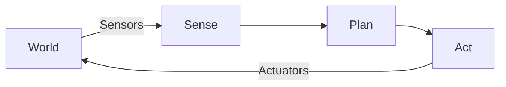

# Introduction to Physical AI

## Overview

Welcome to the frontier of **Physical AI**. Unlike the digital AI you might be familiar with—chatbots, image generators, and recommendation engines—Physical AI is about intelligence that *acts* upon the physical world. It involves systems that perceive their environment through sensors, make decisions based on that perception, and execute actions using actuators. This is the domain of **Embodied Intelligence**: AI that has a body and lives in the same messy, physical reality that we do.

In this course, you will learn to design, simulate, and control humanoid robots using the modern robotics stack: **ROS 2**, **Gazebo**, **Unity**, **NVIDIA Isaac**, and large-scale **Vision-Language-Action (VLA)** models.

## Why This Matters

We are witnessing a paradigm shift. For decades, robotics was dominated by rigid, pre-programmed automation. Today, we are moving toward general-purpose robots that can adapt to unstructured environments. The skills you learn here—bridging the gap between high-level AI reasoning and low-level motor control—are the critical missing link in deploying useful robots into homes and workplaces.

## Key Concepts

### 1. Embodied Intelligence
Intelligence is not just computation; it is interaction. A disembodied brain cannot learn about gravity, friction, or object permanence in the same way a robot can. Embodied intelligence suggests that the body itself shapes the mind.

### 2. The Sense-Plan-Act Loop
All robotic systems operate on a fundamental feedback loop:
- **Sense**: Gather data from the world (cameras, LiDAR, IMUs).
- **Plan**: Process that data to make decisions (path planning, object recognition).
- **Act**: Send commands to motors to change the state of the robot or the world.



### 3. Sim-to-Real Transfer
Training robots in the real world is slow, expensive, and dangerous. We use **Digital Twins**—high-fidelity physics simulations—to train our AI brains safely before transferring them to physical hardware.

## Detailed Explanations

### Generative AI vs. Physical AI
| Feature | Generative AI (LLMs) | Physical AI (Robots) |
| :--- | :--- | :--- |
| **Output** | Text, Images, Code | Motor Torques, Velocities |
| **Constraint** | Context Window, Compute | Gravity, Friction, Battery, Safety |
| **Failure Mode** | Hallucination | Physical Damage, Falling Over |
| **Environment** | Static/Digital | Dynamic/Physical |

### The Real World Challenge
In a simulation, $F=ma$ is always true. In the real world, gears slip, sensors have noise, and battery voltage drops. Physical AI must be robust enough to handle this "reality gap."

## Hands-On Activity: Setting Up Your Environment

Before we build robots, we must build our tools.

**Prerequisites**:
- A computer running **Ubuntu 22.04 LTS** (Native or Dual Boot recommended).
- Familiarity with the command line.

**Task 1: Install ROS 2 Humble**
Follow the standard installation guide for your platform. Verify the install:
```bash
source /opt/ros/humble/setup.bash
ros2 run demo_nodes_cpp talker
```

**Task 2: Install VS Code & Extensions**
- Install [VS Code](https://code.visualstudio.com/).
- Recommended Extensions: *C/C++*, *Python*, *ROS*, *CMake Tools*.

## Summary

You have taken the first step into Physical AI. You understand that we are building systems that close the loop between perception and action. You have set up your development environment and are ready to start building the **Robotic Nervous System** in the next chapter.

## Assessment

1. **Define Embodied Intelligence.**
2. **What are the three stages of the fundamental robotics loop?**
3. **Why is Sim-to-Real transfer critical for humanoid robotics?**
