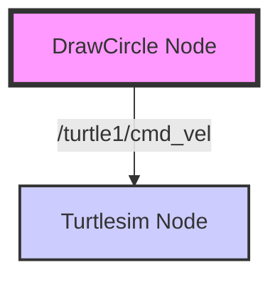

# The Robotic Nervous System (ROS 2)

## 1. Overview

If the robot's body is the hardware, **ROS 2 (Robot Operating System 2)** is its nervous system. It is not an actual operating system like Windows or Linux, but a set of software libraries and tools that help you build robot applications. It provides the plumbing—the message passing system—that allows different parts of the robot (sensors, motors, AI brains) to communicate with each other in real-time.

In this chapter, we will move from theory to practice, setting up your development environment and writing your first ROS 2 software nodes.

## 2. Why This Matters

Complex robots are not monolithic programs. They are distributed systems. The camera driver needs to talk to the computer vision algorithm, which talks to the path planner, which talks to the motor controller.

Without a standard middleware like ROS 2, you would have to write custom socket code for every connection. ROS 2 handles this communication reliability, allowing you to focus on the *behavior* of your robot rather than the plumbing. It is the industry standard for physical AI.

## 3. Key Concepts

### The Graph Metaphor
ROS 2 systems are often visualized as a graph:
- **Nodes**: The executable programs that perform computation (e.g., a laser driver, a path planner).
- **Edges**: The communication channels between nodes.

### Communication Patterns
1.  **Topics (Publish/Subscribe)**:
    -   **One-to-Many**: A node publishes data (e.g., "Camera Frame") to a topic. Any number of nodes can subscribe to that topic.
    -   *Analogy*: A radio broadcast.

2.  **Services (Request/Response)**:
    -   **One-to-One**: A node requests a task (e.g., "Reset Odometry") and waits for a reply.
    -   *Analogy*: A web server request.

3.  **Actions (Goal/Feedback/Result)**:
    -   **Long-Running Tasks**: A node sends a goal (e.g., "Navigate to Kitchen"). The server provides feedback during execution ("I'm 50% there") and a final result.

## 4. Detailed Explanations

### The Workspace
In ROS 2, you work inside a **colcon workspace**. This is a directory where you build your packages.

```bash
mkdir -p ~/ros2_ws/src
cd ~/ros2_ws
colcon build
source install/setup.bash
```

### Nodes in Python (`rclpy`)
We will primarily use the Python client library, `rclpy`. A basic node class looks like this:

```python
import rclpy
from rclpy.node import Node

class MyNode(Node):
    def __init__(self):
        super().__init__('my_node_name')
        self.get_logger().info("Hello, ROS 2!")

def main(args=None):
    rclpy.init(args=args)
    node = MyNode()
    rclpy.spin(node)
    rclpy.shutdown()
```

## 5. Hands-On Activity: Controlling Turtlesim

We will create a package to control the standard ROS 2 simulator, `turtlesim`.

### Step 1: Create the Package
```bash
cd ~/ros2_ws/src
ros2 pkg create --build-type ament_python my_robot_controller --dependencies rclpy
```

### Step 2: Write the Controller
Create `~/ros2_ws/src/my_robot_controller/my_robot_controller/draw_circle.py`:

```python
#!/usr/bin/env python3
import rclpy
from rclpy.node import Node
from geometry_msgs.msg import Twist

class DrawCircle(Node):
    def __init__(self):
        super().__init__('draw_circle')
        # Create a publisher on the /turtle1/cmd_vel topic
        self.cmd_vel_pub = self.create_publisher(Twist, '/turtle1/cmd_vel', 10)
        self.timer = self.create_timer(0.5, self.send_velocity_command)
        self.get_logger().info("Draw Circle Node Started")

    def send_velocity_command(self):
        msg = Twist()
        msg.linear.x = 2.0  # Move forward
        msg.angular.z = 1.0 # Turn left
        self.cmd_vel_pub.publish(msg)

def main(args=None):
    rclpy.init(args=args)
    node = DrawCircle()
    rclpy.spin(node)
    rclpy.shutdown()
```

### Step 3: Register the Executable
Edit `setup.py` in your package and add the entry point:

```python
'console_scripts': [
    'draw_circle = my_robot_controller.draw_circle:main',
],
```

### Step 4: Build and Run
```bash
cd ~/ros2_ws
colcon build --symlink-install
source install/setup.bash

# Terminal 1: Run the sim
ros2 run turtlesim turtlesim_node

# Terminal 2: Run your node
ros2 run my_robot_controller draw_circle
```

## 6. Architecture Diagram

Below is the communication flow for our Hands-On Activity:



## 7. Troubleshooting Tips

-   **"Command not found"**: Did you run `source install/setup.bash`? You must do this in every new terminal.
-   **Nodes can't see each other**: Ensure both terminals are on the same network and `ROS_DOMAIN_ID` is consistent (default is 0).
-   **Python errors**: Check your indentation and ensure `rclpy.init()` is called.

## 8. Summary

You have successfully set up a ROS 2 workspace and written your first publisher node. You learned that ROS 2 is a graph of nodes exchanging messages via topics. This "nervous system" is what we will build upon to connect cameras, sensors, and AI models in future chapters.

## 9. Assessment

**Exercise**: Modify the `draw_circle.py` node to subscribe to the `/turtle1/pose` topic. Print the turtle's X and Y coordinates to the console whenever a message is received.
