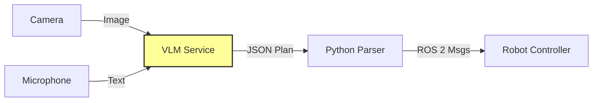

# Vision-Language-Action (VLA)

## 1. Overview

For decades, robots were "blind" executors of code. You had to explicitly program every coordinate. **Vision-Language-Action (VLA)** models change this paradigm. They allow robots to understand natural language commands ("Clean up the spill") and visual context, translating them directly into robot actions.

## 2. Why This Matters

If you tell a traditional robot "fetch the bottle," it throws an error because it doesn't know what a "bottle" is. A VLA model has seen millions of internet images. It knows what a bottle looks like, where it is usually found, and how to grab it. This provides **common sense reasoning** to physical systems.

## 3. Key Concepts

### Multimodality
A VLA model takes multiple types of inputs:
1.  **Visual**: An image from the robot's camera.
2.  **Text**: A user instruction.
3.  **State**: (Optional) Current joint angles.

It outputs:
1.  **Action**: Either a high-level plan ("Move to table") or low-level joint velocities.

### Grounding
**Grounding** is the problem of linking the word "apple" to the specific cluster of red pixels in the camera frame. VLAs solve this by learning semantic representations of the world.

## 4. Detailed Explanations

### The Pipeline
1.  **Perception**: Camera captures `image.jpg`.
2.  **Reasoning**: VLM (like GPT-4o or Gemini 1.5 Pro) analyzes the image + instruction.
3.  **Planning**: VLM outputs a JSON or code snippet.
4.  **Execution**: ROS 2 node executes the code.

## 5. Hands-On Activity: "Reason to Act"

We will build a simple VLA agent that looks at a scene and decides which object to pick up.

### Step 1: Setup the API
(This example uses pseudo-code for a generic VLM API)

```python
import base64
from my_vlm_library import VLMClient

def analyze_scene(image_path, user_instruction):
    client = VLMClient(api_key="...")
    
    with open(image_path, "rb") as img:
        encoded_string = base64.b64encode(img.read()).decode('utf-8')

    prompt = f"""
    You are a robot arm. 
    User Instruction: {user_instruction}
    Look at the image. Return a JSON object with the coordinates (x, y) of the target object.
    Format: {{"target": "name", "x": 0.5, "y": 0.5}}
    """
    
    response = client.generate(image=encoded_string, text=prompt)
    return response
```

### Step 2: The ROS 2 Action Node

```python
def execute_action(target_coords):
    # Convert 2D image coords to 3D world coords (simplified)
    # Publish to /arm_controller/follow_joint_trajectory
    pass
```

## 6. Architecture Diagram

VLA Control Loop:



## 7. Summary

VLAs bridge the semantic gap. They allow us to talk to robots like humans. However, they are slow (high latency). For real-time control, we often use the VLA to generate a *waypoint*, and a fast local controller to reach it.

## 8. Assessment

**Scenario**: You ask the robot to "throw away the trash."
**Question**: What could go wrong if the VLA hallucinates? How do we add safety guardrails?
